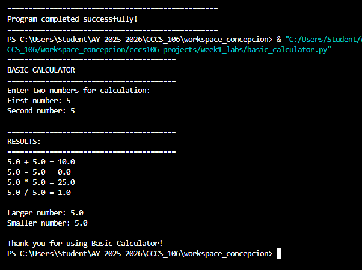
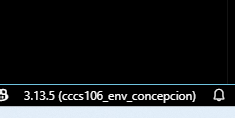
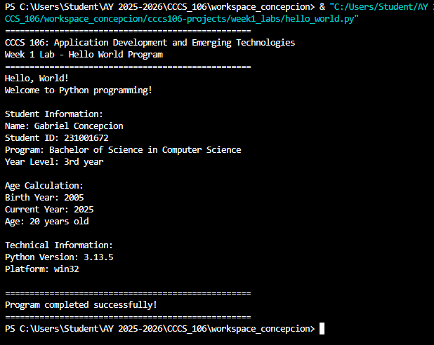
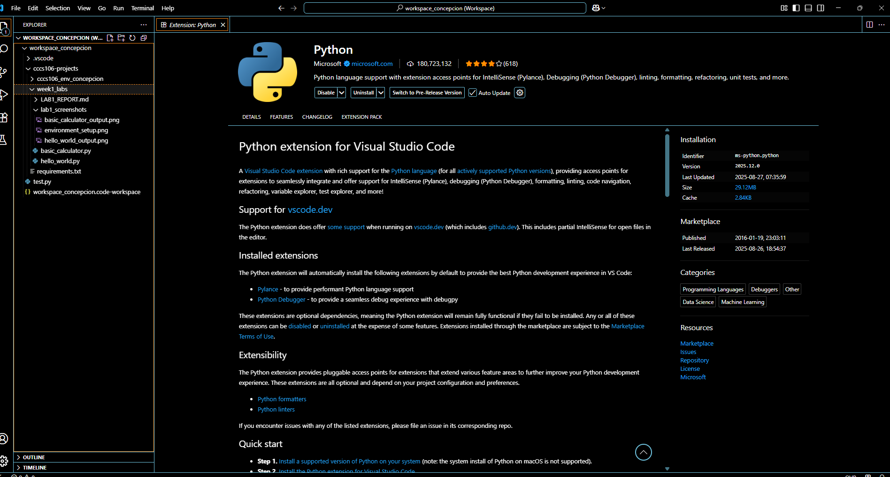

# Lab 1 Report: Environment Setup and Python Basics

**Student Name:** Gabriel Concepcion
**Student ID:** 231001672
**Section:** BSCS3B
**Date:** 08/27/25

## Environment Setup

### Python Installation
- **Python Version:** 3.13.5
- **Installation Issues:** [Describe any problems and solutions]
- **Virtual Environment Created:** ✅ cccs106_env_concepcion

### VS Code Configuration
- **VS Code Version:** 1.103.2
- **Python Extension:** ✅ Installed and configured
- **Interpreter:** ✅ Set to cccs106_env_concepcion/Scripts/python.exe

### Package Installation
- **Flet Version:** 0.28.3
- **Other Packages:** [List any additional packages]

## Programs Created

### 1. hello_world.py
- **Status:** ✅ Completed
- **Features:** Student info display, age calculation, system info
- **Notes:** Change student name, date, student_id, birth year, year_level and program 

### 2. basic_calculator.py
- **Status:** ✅ Completed
- **Features:** Basic arithmetic, error handling, min/max calculation
- **Notes:** None

## Challenges and Solutions

Challenge: Interpreter not showing in VS CODE;
Solution: Selecting the direct python interpreter file

## Learning Outcomes

I learned to how to install python and set up or create a virtual environment
I understand how VS Code workspace keep my project organized
I practice writing my first Python programs with input, output and basic error handling 

## Screenshots

