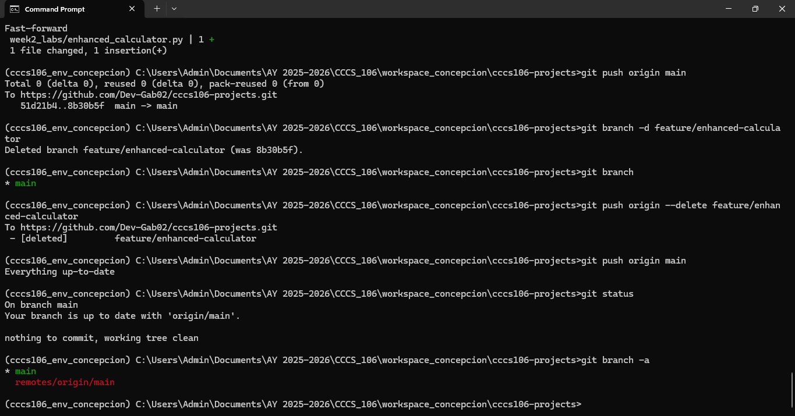
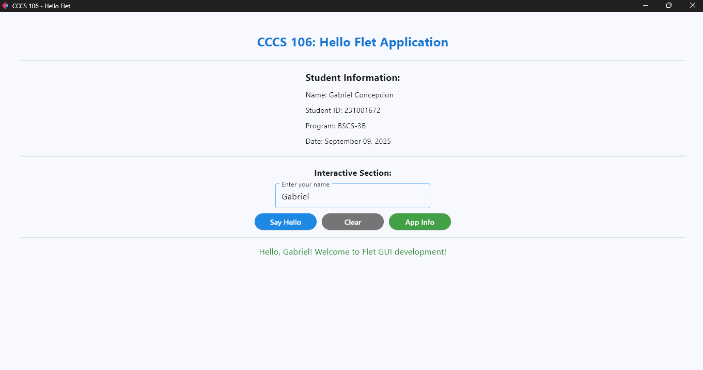
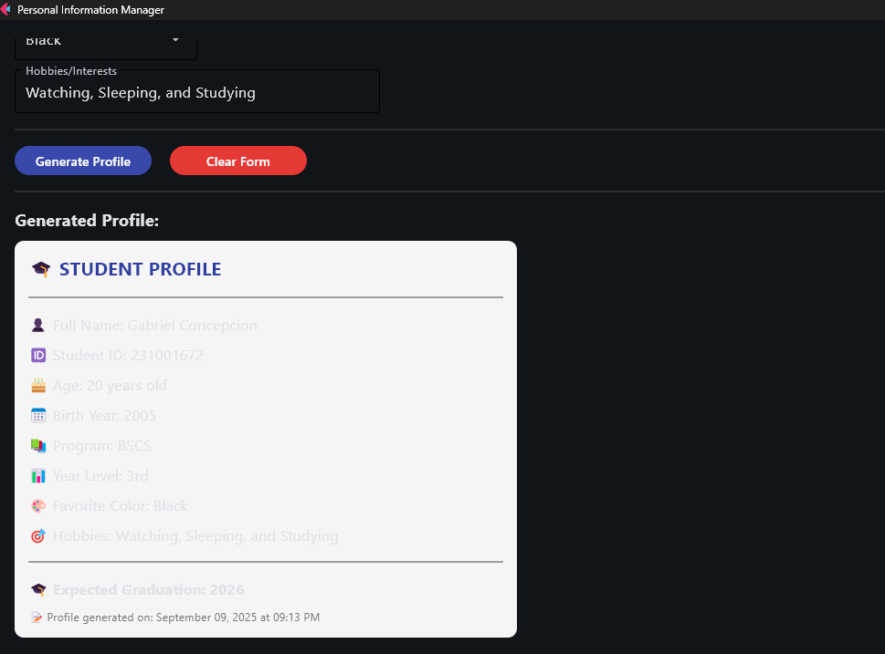

# Lab 2 Report: Git Version Control and Flet GUI Development

**Student Name:** Gabriel Concepcion
**Student ID:** 231001672
**Section:** BSCS-3B
**Date:** 09/09/25

## Git Configuration

### Repository Setup
- **GitHub Repository:** https://github.com/Dev-Gab02/cccs106-projects
- **Local Repository:** ✅ Initialized and connected
- **Commit History:** 8 commits with descriptive messages

### Git Skills Demonstrated
- ✅ Repository initialization and configuration
- ✅ Adding, committing, and pushing changes
- ✅ Branch creation and merging
- ✅ Remote repository management

## Flet GUI Applications

### 1. hello_flet.py
- **Status:** ✅ Completed
- **Features:** Interactive greeting, student info display, dialog boxes
- **UI Components:** Text, TextField, Buttons, Dialog, Containers
- **Notes:** N/A

### 2. personal_info_gui.py
- **Status:** ✅ Completed
- **Features:** Form inputs, dropdowns, radio buttons, profile generation
- **UI Components:** TextField, Dropdown, RadioGroup, Containers, Scrolling
- **Error Handling:** Input validation and user feedback
- **Notes:** N/A

## Technical Skills Developed

### Git Version Control
- Understanding of repository concepts
- Basic Git workflow (add, commit, push)
- Branch management and merging
- Remote repository collaboration

### Flet GUI Development
- Flet 0.28.3 syntax and components
- Page configuration and layout management
- Event handling and user interaction
- Modern UI design principles

## Challenges and Solutions

Challenge: Forgetting to stage files before committing.

Solution: Used git status frequently to verify changes and always staged with git add.

## Learning Outcomes

I learned how Git helps in managing versions of a project and why commit messages are important.

I now understand how to use branches in Git to safely add new features without breaking the main code.

I became familiar with creating simple GUI applications using Flet and handling user input effectively.

This exercise improved my confidence in using both version control and GUI frameworks together in a real project workflow.

## Screenshots

### Git Repository
- [ ] GitHub repository with commit history
- [ ] Local git log showing commits

### GUI Applications
- [ ] hello_flet.py running with all features
- [ ] personal_info_gui.py with filled form and generated profile

## Future Enhancements

Add an Enhanced Calculator GUI with full arithmetic operations and error handling.

Improve personal_info_gui.py by adding profile picture upload support.

Combine multiple apps into a single dashboard for easier navigation.